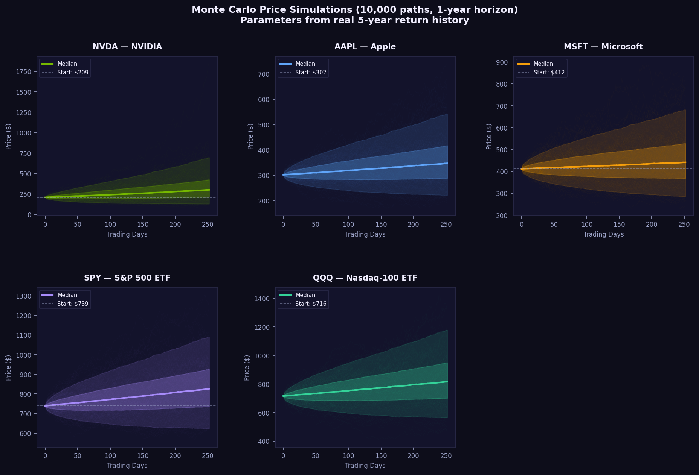
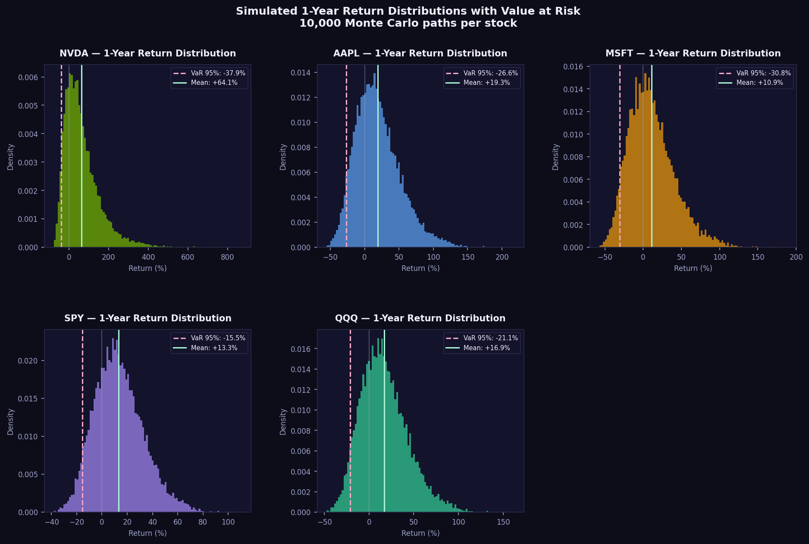
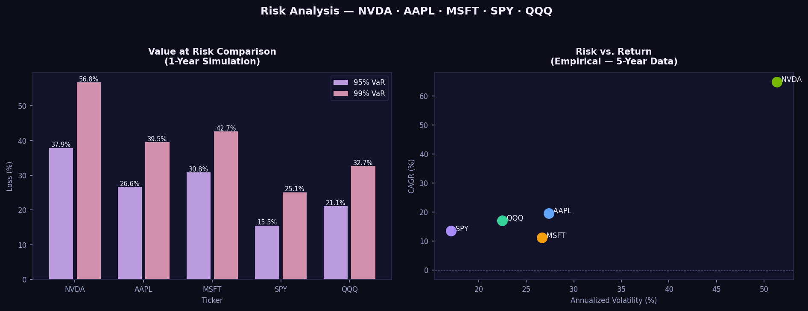

# 📈 Monte Carlo Stock Price Simulation

A quantitative finance project that downloads real stock price history, computes return statistics, simulates 10,000 future price paths, and measures risk with Value at Risk (VaR).


-----

## 📡 Real Data

Downloads 5 years of daily prices via **yfinance**. If Yahoo Finance is unavailable, falls back to verified published annual returns with a clear console message.

|Ticker|2020 |2021 |2022|2023 |2024 |Source                         |
|------|-----|-----|----|-----|-----|-------------------------------|
|NVDA  |+122%|+125%|−50%|+239%|+171%|FinanceCharts / Macrotrends    |
|AAPL  |+81% |+35% |−26%|+49% |+31% |FinanceCharts / Macrotrends    |
|MSFT  |+41% |+51% |−28%|+58% |+13% |FinanceCharts / Macrotrends    |
|SPY   |+18% |+29% |−18%|+26% |+25% |Macrotrends / SPDR             |
|QQQ   |+49% |+27% |−33%|+55% |+26% |FinanceCharts / TradesThatSwing|

-----

## 🚀 How to Run

```bash
pip install -r requirements.txt
python monte_carlo.py
```

-----

## 📊 Outputs

```
figures/
  fig1_fan_charts.png           # Price range bands for all 5 stocks
  fig2_return_distributions.png # Histogram of 10,000 simulated returns
  fig3_risk_comparison.png      # VaR comparison + risk-return scatter

outputs/
  stock_statistics.csv          # Empirical μ, σ, CAGR per ticker
  simulation_results.csv        # VaR, CVaR, P(profit) per ticker
```

-----

## 📂 Project Structure

```
monte-carlo/
├── monte_carlo.py    # Main script
├── requirements.txt
├── README.md
├── figures/
└── outputs/
```

-----

## Sample Results

### Monte Carlo Fan Charts


### Return Distributions


### Risk Comparison


-----

## 👤 Author

**Jahari Lockett** — Data Science & Analytics, Florida Atlantic University
[LinkedIn](https://www.linkedin.com/in/jahari-e-lockett-b4aa04246/) 
